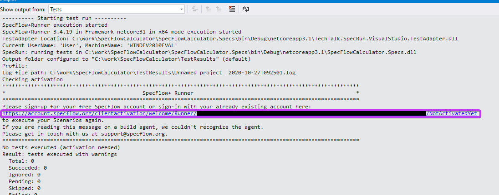

# Credit Card Form Backend

This is the backend API for my frontend app.🚀🚀

---

## Features

- .Net Core 3.1

- MongoDB Driven

- xUnit + Bogus + Fluent + SpecFlow

- Swagger API Documentation included

## Setup

Please make sure .NET Core 3.1 installed.

## MongoDB

Here is the overall view for my MongoDB dashboard.

## SpecFlow
I used `SpecFlow+ Runner` as my test runner. You might need activate yourself when execute my tests with it for the first time

More details you can follow [this link](https://docs.specflow.org/projects/specflow-runner/en/latest/Installation/Installation.html)

## TODO

 - [ ] Better secured APIs
 - [ ] More tests

## TLDR

Apologized, being so super busy these weeks, and haven't finish for all. 🙇🙇

---

Create an API to receive the data captured in the frontend.

We recommend using C#, .Net Core, and WebAPI to build this API.

## Specification
- Inputs:
    - Name (any alphanumeric character - maximum 50)
    - Credit card needs to be numeric and be in the valid credit cards storage
    - CVC is any number
    - Expiry date is any valid date
- One operation to store the input data
    - Validate the information received from the frontend
- One operation to query all data that has been stored
- One operation to query one of the input data stored
- Storage (optional)
    - Create the storage for the valid credit card
    - Create the storage for the input fields
- Use REST standards

## Commits
Please commit frequently to communicate your throughts while working on this assignment

## What is valued
- Clean code
- Design patterns
- Unit tests
- Integration tests
- Performance
- Security
- Dependency injection
- Http verbs, and resources naming
- API documentation for consumers

## Duration
Use about 2 hours on this assignment. You are expected to complete most of what is defined in the specification section also considering the things we value.

## Tech
- API following the REST standards